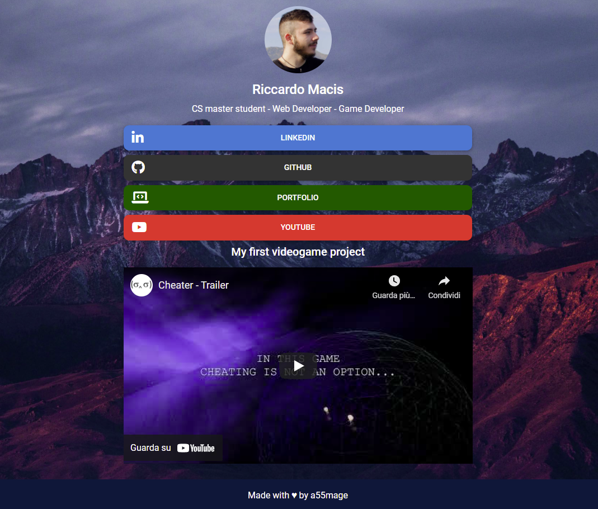
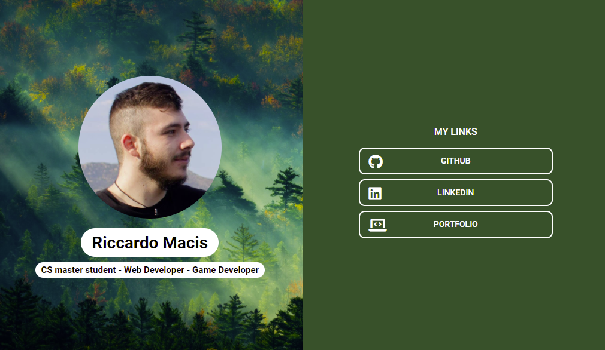

# LinkFolio
### A Linktree-like Material Design Bootstrap template

Drop a ⭐ if you like it

  
  
  

MDB5
Version: FREE 3.11.0

Documentation:
https://mdbootstrap.com/docs/standard/

## Linktree template example

## Cardd template example

## 🛠️ Usage
A minimun knownledge of Bootstrap and CSS syntax are required

### 📄 linkFolio.html
The Linktree copycat template

Contains every component you might need, just remove or copy/paste what you need and customize contents

### 📄 doubleSide.html
This is a double sided template inspired by cardd.co

Same as above, remove or copy/paste what you need and customize contents

### 🖌️ style.css
This is the only css file you should edit, it's organized based on the different section of the template

### ⚙️ custom CSS classes & tips
Through the CSS you can change:
- Background image
- Background color
- Icon position inside the buttons
- Font size and colors
- Margins

However, remember that with bootstrap you can also use library classes directly inside your HTML element for simple changes such as font color or size.

### 🖼️ img folder
I've included a small collection of pictures (< 1MB each) to be used as backgrounds